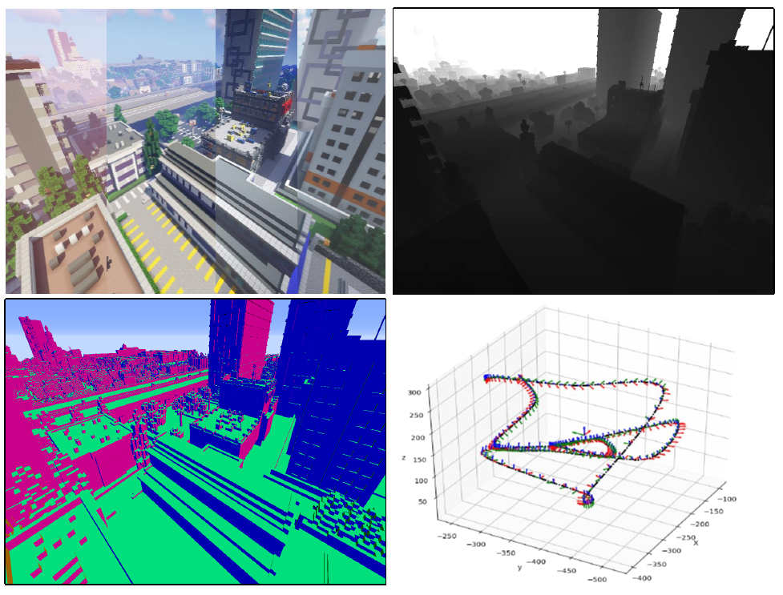
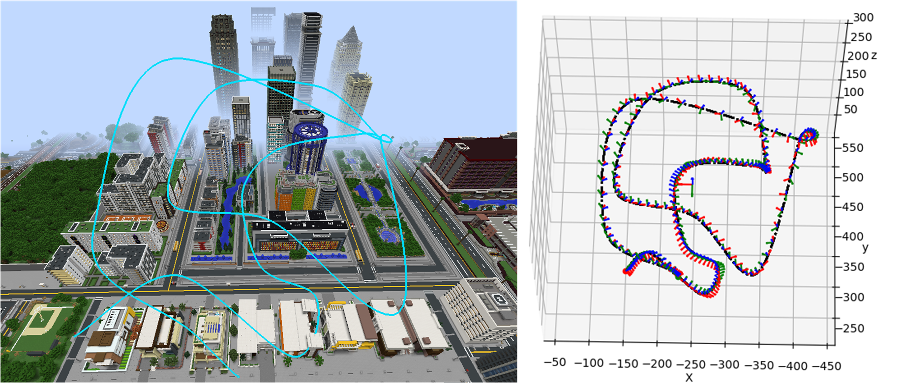
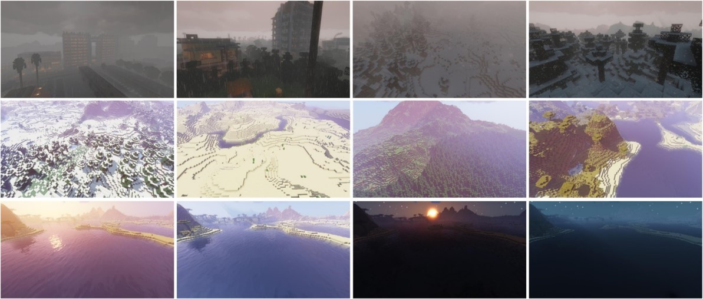

# MineNavi

MineNavi
--基于*Minecraft*的可拓展虚拟数据集


<center>MineNavi</center>

主要包括两大部分, 图像序列处理以及路径处理

图像序列处理中,有:
- MineCraft视频处理(video_process)
- Minecraft ground-truths and shaders (shaders)
- datasets 分割,校验(datasets)

路径处理中,有:
- aperture中的文件预处理(json_prep)、处理导出(aperture)
- 路径可视化(viz)

文件夹如下

```
./
  |- json_prep
  |- aperture.py
  |- viz
  |- utils
  |- video_precess
  |- datasets
  |- MineNavi-datasets.zip

```
其中, [MineNavi-datasets](./MineNavi-datasets.zip)是我们构建的5个数据集, 以运动模式--path name--光照条件--图像序列组织. 
## 一、path数据


<center>MineNavi path 数据 </center>


### aperture

根据aperture的json文件， 插值并输出不同格式的path文件

aperture json file ===**aptPath2pose6dof**===> pose6dof_keypoints 
===**interpolaration_xdof**===> timestamp,poses_6dof 

输入 json， 输出 dir/


### viz

static_draw

dynamic_draw

lambda_draw

根据输入的mc格式的path文件，画出:
静态3dpath, 动态3dpath, lambda曲线


### utils

- fio/文件工具

- rotation/处理旋转相关

- formater/处理不同数据集中path的格式相关

- cubic_hermite.py/和aperture完全一样的插值方法, 保证视频中的路径和外面导出的一致

**path数据处理流程**

- step.1 通过手动编辑json或者aperture内可视化交互编辑路径, 得到原始json文件

- step.2 将json文件中不同path分开

- step.3 将分开后的*.json通过aperture.py更改path的格式, 包括mc格式, kitti格式, EuRoC格式(未实现)
  
- step.4 将更改格式后的path文件(`*.txt`)对齐,保存.


## 二、图像


<center>MineNavi图像数据 </center>

### video_process

`Aperture` 中, 每个json文件可能有很多的fixtures, 而且fixtures的种类也可能很多, 例如keyframe,path等. 这里仅采用path.

  1. 通过`video2frame_lite.py`, 将视频以特定帧率处理为帧

  输出为video名字一样的文件夹, 每个video对应为不同


   2. 通过`frames2dirs.py` 分割图像序列
  
  这里生成的json文件中只含有path类fixture, 每个path在设定的时候也可能并不连续, 因此基于一整段path导出视频, 并按照path导出对应的**连续图像序列**. 将刚刚得到的长序列合并的total_frame_dir 按帧数量分割成子文件夹

例如

```
  |-0xdir #按照 path命名的场景名称
  	|-0000.png
  	|-0001.png
  	|-..
  	|-1399.png
  
  ==frames2dirs.py==>
  
  |-split
  	|-0000 #path序号
  	   |-0000.png
  	   |-0001.png
  	   |-...
  	   |-0049.png
  	|-0001
  	   |-0001.png
  	   |-...
  	|-0027
  	   |-0001.png
  	   |-..
```
note: 场景名称与场景序号有对应关系, 注意记录, 以防数据没对齐

  3. 依照`path_no-lights_no-images_no` 重构
  
  现在已经得到依照path连续, 分成不同文件夹的图像序列, 所有序列中都是依照一种光照情况得到的, 而dataset中具有多种光照情况. 所以现在要将一种光照情况下, 多个path对应的图像序列, 分发到光照条件的子文件夹下, 即

  ```
  ./sildurs(h)
    |- 0000
      |- 0000.png
      |- 0001.png
    |- 0001
      ...

        ==distribute insert==>

    ./
    |- 0000
      |- color
        |- 0000.png
        |- 0001.png
      |- depth
        |- 0000.png
        |- 0001.png
      |- sildurs(h)
        |- 0000.png
        |- 0001.png
      ...

  ```

  以上是通过`files_restruct_*.sh`脚本调用`files_restruct.py`实现
 
 

### datasets

得到完整数据集后, 可以通过`dataset_file_check.py`进行校验, 测试是否正确对其, 但是准确度有限.

而后, 基于完整构建的数据集, 可以通过`minenavi_split.py`来建立索引, 并且包含对path的过滤, 和对光照条件的过滤.

深度图为8bit, 为了建立深度值和游戏场景中尺度的关系, 可以通过间隔距离, 采集图像, 载入图像对应位置获取灰度. 基于`depth_measure.py`


**图像数据处理流程**

 - step.1 video 2 frames
 
 把shader名字 ctrl f 换了然后
 ```apex
bash split.sh
```
 
 - step.2 frame 2 dirs
  
   类似的, 把shader名字换了
 ```apex
bash frame2dirs.sh
```

- step.3 dirs distribute

```apex
bash files_restruct_0*.sh

bash files_restruct_0*.sh
...


```

至此, 得到了匹配的图像序列以及ground-truth.

- step.4 校验数据对其与否

编辑`dataset_file_check` 并且`python dataset_file_check.py`


- step.5 构建数据集索引


